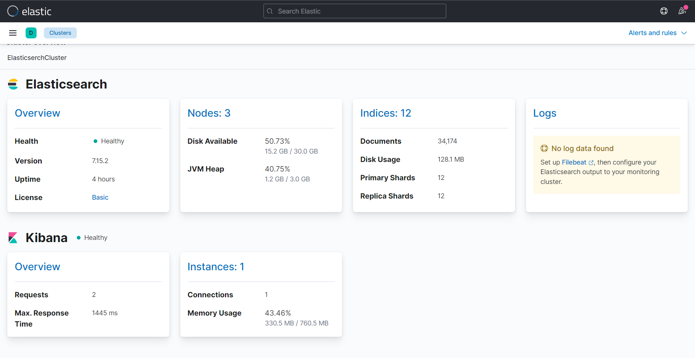
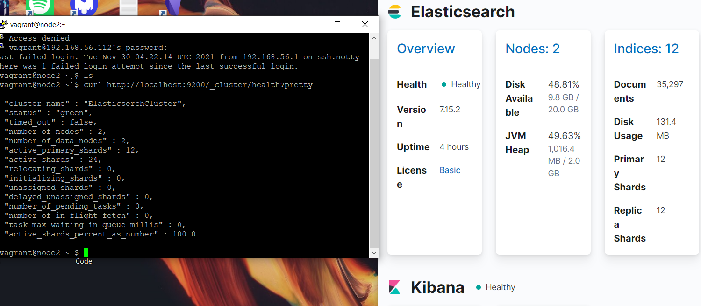
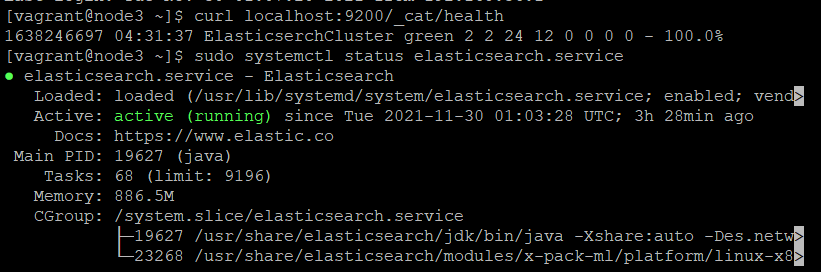
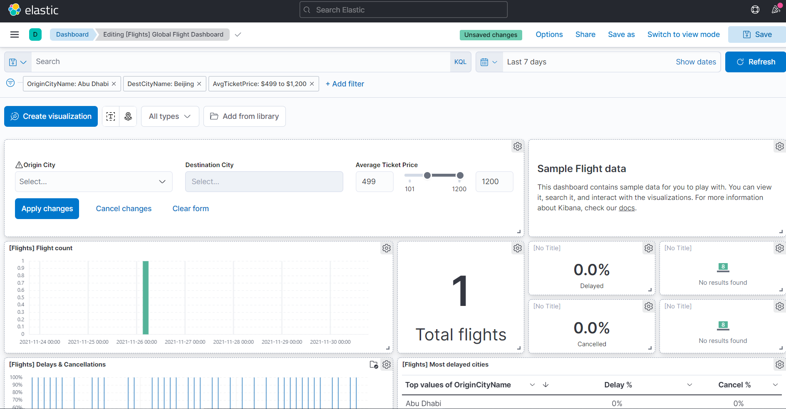

# QO-DevOps-Task

## 1. Set up a 3 node Elasticsearch cluster on Linux. You will need to create 3 Linux nodes on the same network to talk to each other in a virtual environment (VMware/VirtualBox/Cloud Provider) and configure the cluster.


## 2. Test the redundancy of the cluster. 
### 1. Shut down a node and confirm that the cluster is still operational

### 2. Use various commands to confirm that processes and/or services are running
```
curl localhost:9200/_cat/health
sudo systemctl status elasticsearch.service
```

## 3. Create a simple Kibana dashboard.


